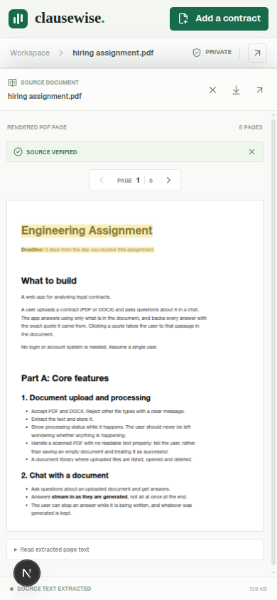
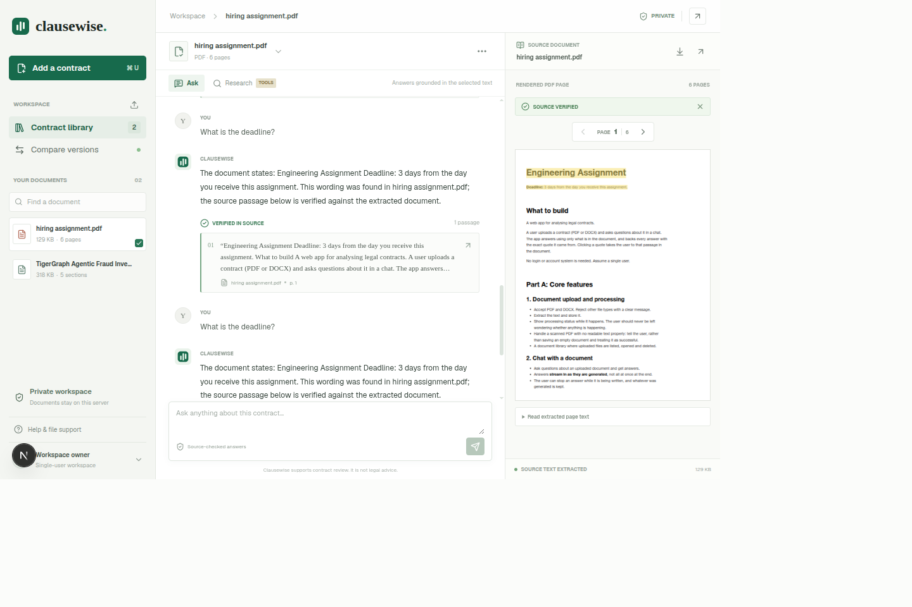

# Clausewise

Contract analysis workspace for reviewing agreements with source-grounded answers, verified citations, research, and clause comparisons.

## Run locally

First, run the development server:

```bash
# Clausewise

Clausewise is a contract review workspace for asking questions about agreements, tracing answers to verified source passages, researching across documents, and comparing contract versions.


## Features

- **PDF and DOCX library:** Upload readable contracts, follow processing status, reopen or delete documents, and view the extracted source.
- **Grounded chat:** Ask questions about one or up to four selected documents. Answers stream as they are generated, can be stopped, and chat history is saved with the documents.
- **Verified citations:** Citation text is normalized and located in the extracted document by the application. Clicking a citation opens its source location and highlights the passage when the rendered layout permits.
- **Research mode:** With an AI provider configured, the model can search document text, read a section, or list likely clause headings. Research progress is visible and the tool loop is capped at four rounds.
- **Version comparison:** Compare two agreements at paragraph/clause level, review before-and-after wording, and filter changes by heuristic significance.
- **Local demo mode:** Core evidence search and fallback answers work without an AI API key.

Clausewise is a review aid, not legal advice. Retrieval and clause comparison are heuristic; they do not establish that a clause is legally absent, equivalent, or correctly interpreted.

## Screenshots

### Contract workspace


### Mobile source review



### Verified citation highlight



## Technology

- Next.js App Router, React, and TypeScript
- PDF.js (`pdfjs-dist`) for PDF text extraction and page rendering
- Mammoth for DOCX text extraction
- OpenAI-compatible Chat Completions API for optional generated answers and agentic research
- Local JSON and filesystem persistence for the single-user development/demo workspace
- Vitest and ESLint

## Run locally

Requirements: Node.js 22 is used by the included Dockerfile; npm is used for dependency management.

```bash
cd clausewise
npm ci
cp .env.example .env.local
npm run dev
```

Open [http://localhost:3000](http://localhost:3000). The app can run without an AI provider; leave the provider values empty for local evidence mode.

To enable model-backed answers and research, set these values in `clausewise/.env.local`:

| Variable | Purpose | Default |
| --- | --- | --- |
| `OPENAI_API_KEY` | Provider API key | Empty; local evidence mode |
| `OPENAI_BASE_URL` | OpenAI-compatible API base URL | `https://api.openai.com/v1` |
| `OPENAI_MODEL` | Chat-completions model name | `gpt-4o-mini` |

Never commit `.env.local` or API keys.

## Development commands

Run these from `clausewise/`:

```bash
npm run dev       # Start the development server
npm test          # Run Vitest
npm run lint      # Run ESLint
npm run build     # Create the production build
npm start         # Serve the production build
```

## Vercel deployment

The Vercel configuration is [clausewise/vercel.json](clausewise/vercel.json). Because the app is in a subdirectory, configure the Vercel project as follows:

1. Import this repository into Vercel.
2. Set **Root Directory** to `clausewise` and enable including files outside the root directory only if your Vercel project requires it. The app and its build inputs are inside `clausewise/`.
3. Use the Next.js framework preset. `vercel.json` selects Next.js, `npm ci`, and `npm run build`.
4. Add `OPENAI_API_KEY`, `OPENAI_BASE_URL`, and `OPENAI_MODEL` in the Vercel project settings if model-backed features are needed. Do not add an API key to source control.
5. Deploy.

### Deployment limitation

The current document store writes originals and `documents.json` to `.data/` on the local filesystem. Vercel Functions do not provide durable, shared application storage, so uploads and chat history are **not reliable on Vercel** and may fail or disappear between invocations. Do not use this deployment for real or sensitive contracts until the store is replaced with durable database/object storage and access controls. The application accepts files up to 45 MB, but the hosting platform may impose a smaller request-body limit; supporting large uploads requires direct-to-object-storage upload flow.

## Current limitations

- No authentication or multi-user isolation.
- Scanned PDFs are rejected when no readable text is extracted; OCR is not enabled.
- Search ranks lexical matches across extracted text; semantic embeddings are not implemented.
- DOCX is represented as extracted text sections, not rendered original pages.
- Comparison and significance ranking are heuristic, even when an optional model summary is available.
- The optional agentic research loop requires a configured provider; local mode does not run model tools.
- Durable encrypted storage, production deployment hardening, export, and tracked-change redlining are not implemented.

## Project documentation

- [Product requirements](Docs/PRD.md)
- [Architecture](Docs/ARCHITECTURE.md)
- [Project rules](Docs/RULES.md)
- [Design notes](Docs/DESIGN.md)
- [Task list](Docs/TASKS.md)
- [Project memory](Docs/MEMORY.md)
- [Hiring assignment](Docs/hiring%20assignment.pdf)
- [Implementation note](clausewise/docs/approach-note.md)
